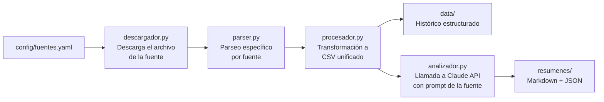

# mercados-diario

Sistema modular de monitorización diaria de mercados financieros con resúmenes generados por IA.

Descarga datos públicos de fuentes financieras cada día, los almacena como histórico estructurado, y genera un resumen ejecutivo con Claude API en el tono de una consultora de primer nivel (Goldman Sachs / Morgan Stanley).

---

## Arquitectura modular

El principio de diseño central es que **añadir una fuente nueva no requiere tocar la lógica del sistema**. Solo hay que crear una entrada en `config/fuentes.yaml` y, si el formato de datos es nuevo, un parser específico en `fuentes/<nombre>/parser.py`.

```
config/fuentes.yaml         ← Fuente nueva declarada aquí
fuentes/<nombre>/parser.py  ← Lógica de parseo específica (si hace falta)
fuentes/<nombre>/prompt.md  ← Prompt de IA adaptado a esa fuente
```

El núcleo (`core/`) no necesita modificarse.

---

## Cómo funciona



---

## Estructura de carpetas

```
mercados-diario/
├── config/
│   └── fuentes.yaml          ← Configuración declarativa de cada fuente
├── core/                     ← Lógica genérica reutilizable
│   ├── descargador.py        ← Descarga archivos por URL parametrizada
│   ├── procesador.py         ← Lee y transforma archivos a CSV unificado
│   ├── analizador.py         ← Llama a Claude API para generar resumen
│   └── utils.py              ← Helpers comunes (fechas, logging, etc.)
├── fuentes/                  ← Módulos específicos por fuente
│   └── meff/
│       ├── parser.py         ← Parseo específico del Excel del MEFF
│       └── prompt.md         ← Prompt de IA estilo Goldman Sachs para MEFF
├── data/                     ← Histórico de datos transformados (CSV)
├── resumenes/                ← Resúmenes generados (Markdown + JSON)
├── .github/workflows/
│   └── ejecucion_diaria.yml  ← GitHub Action programado (lun–vie, 08:00 UTC)
└── tests/
```

---

## Cómo añadir una fuente nueva

1. Abre `config/fuentes.yaml` y añade una nueva entrada con la misma estructura que `meff`:

```yaml
nueva_fuente:
  nombre: "Nombre Descriptivo"
  descripcion: "Qué datos proporciona esta fuente"
  url_plantilla: "https://ejemplo.com/datos/{fecha}.xlsx"
  formato: xlsx          # xlsx, csv, json...
  parser: nueva_fuente   # nombre de la carpeta en fuentes/
  prompt: nueva_fuente   # nombre del prompt en fuentes/<nombre>/prompt.md
```

2. Crea `fuentes/nueva_fuente/parser.py` con una función `parsear(ruta_archivo)` que devuelva un `pd.DataFrame` normalizado.

3. Crea `fuentes/nueva_fuente/prompt.md` con el prompt de IA adaptado a esa fuente.

4. Listo. El sistema lo recogerá automáticamente en la próxima ejecución.

---

## Configuración local

```bash
python -m venv .venv
.venv\Scripts\activate        # Windows
pip install -r requirements.txt

# Crea un archivo .env con tu clave de API:
# ANTHROPIC_API_KEY=sk-ant-...
```

---

## Fuentes activas

| Fuente | Descripción | Frecuencia |
|--------|-------------|------------|
| MEFF | Mercado Español de Futuros y Opciones — volumen y open interest de derivados | Diaria (L–V) |

---

## Uso

```bash
# Solo descarga (sin procesar ni analizar)
python -m fuentes.meff.parser 2026-06-04

# Descarga + parseo + histórico + anomalías
python -m fuentes.meff.parser 2026-06-04 --procesar

# Pipeline completo: procesa y genera resumen IA (requiere ANTHROPIC_API_KEY)
python -m fuentes.meff.parser 2026-06-04 --analizar

# Usar último día hábil automáticamente
python -m fuentes.meff.parser --analizar

# Recuperar días pendientes (últimos 10 días hábiles sin resumen, máx 5)
python -m fuentes.meff.parser --recuperar
```

Los resúmenes generados se guardan en `resumenes/meff/`:
- `YYYY-MM-DD.md` — texto Markdown listo para leer
- `YYYY-MM-DD.json` — metadatos (modelo, tokens, coste, texto)

---

## Ejecución automática

### Workflow programado

El GitHub Action `Resumen Diario MEFF` se ejecuta automáticamente **de lunes a viernes a las 08:00 UTC** (09:00 España en invierno, 10:00 en verano). A esa hora el MEFF ha publicado las estadísticas del cierre del día anterior.

Cada ejecución:
1. Descarga el Excel del MEFF del último día hábil
2. Lo parsea y actualiza el histórico CSV
3. Detecta anomalías
4. Genera el resumen con Claude API
5. Hace commit y push del resumen al repositorio

**Frecuencia estimada:** ~22 ejecuciones/mes · ~$0,02–$0,03 por ejecución · **total ~$0,50–$0,75 USD/mes**

### Ejecución manual

Desde la pestaña **Actions** → **Resumen Diario MEFF** → **Run workflow**:

- Deja el campo `fecha` vacío para procesar el último día hábil.
- O introduce una fecha concreta en formato `YYYY-MM-DD` para regenerar un día específico.

### Ver logs de ejecuciones pasadas

En la pestaña **Actions**, haz clic en cualquier ejecución. Los logs de Python se descargan como artifact (`logs-ejecucion-<run_id>`) y se conservan 30 días.

### Recuperar días pendientes

Si el workflow falla varios días seguidos (puente largo, incidencia en GitHub Actions, etc.), ejecuta localmente:

```bash
python -m fuentes.meff.parser --recuperar
```

Detecta los últimos 10 días hábiles sin resumen y genera hasta 5 de ellos. Ejecuta varias veces si hay más de 5 pendientes.

### Notificaciones de error

GitHub envía un email automáticamente cuando un workflow falla repetidamente. Para activarlo:

> **Settings → Notifications → Actions → marcar "Send notifications for failed workflows only"**

No se requiere ninguna integración adicional con servicios externos.

---

## Comportamiento ante archivos no disponibles

El sistema, en **modo automático** (`--analizar` sin fecha), nunca falla el workflow por datos no publicados aún. Usa una estrategia de *retry hacia atrás*:

1. Calcula el último día hábil (ej: viernes si hoy es sábado).
2. Si ese día ya tiene resumen → retrocede al día hábil anterior.
3. Si la descarga falla (404, MEFF no ha publicado el archivo) → retrocede al día hábil anterior.
4. Repite hasta 3 días hábiles hacia atrás.

| Resultado tras los intentos | Estado | Código de salida |
|-----------------------------|--------|-----------------|
| Se descargó y procesó un día | `procesado` | 0 |
| Todos los días ya tenían resumen | `todos_al_dia` | 0 |
| Ningún Excel disponible | `no_disponible` *(WARNING)* | 0 |
| Error real (parseo, análisis IA) | `error` | 1 |

En **modo explícito** (se pasa una fecha concreta), el comportamiento es estricto:
- Si el resumen ya existe → WARNING + exit 0 (no reprocesa).
- Si la descarga falla → exit 1 (el usuario especificó la fecha, es su responsabilidad).

---

## Variables de entorno

| Variable | Requerida | Descripción |
|----------|-----------|-------------|
| `ANTHROPIC_API_KEY` | Sí (para `--analizar`) | Clave de API de Anthropic. Obtener en [console.anthropic.com](https://console.anthropic.com). |

Crea un archivo `.env` en la raíz del proyecto (nunca lo subas al repositorio):

```
ANTHROPIC_API_KEY=sk-ant-...
```

En GitHub Actions, añade la variable como Secret en Settings → Secrets → Actions.

---

## Gráficos interactivos

Cada resumen diario incluye 2-3 gráficos interactivos HTML generados automáticamente con [Plotly](https://plotly.com/python/).

### Motor de renderizado

Plotly genera HTML inline con JavaScript desde CDN (`cdn.plot.ly`). Los gráficos se embeben directamente en el `.md` del resumen como bloques HTML, por lo que el portfolio los renderiza sin archivos adicionales ni servidor.

### Cómo Claude decide qué gráficos generar

El prompt instruye a Claude a evaluar la sesión y emitir al final de su respuesta un bloque JSON delimitado con las especificaciones de los gráficos a generar:

```
===GRAFICOS===
{ "graficos": [ { "tipo": "...", "titulo": "...", "parametros": {...} } ] }
===FIN GRAFICOS===
```

Las reglas son:
- **`top_movers_oi`** — si hay movimientos de Open Interest >15% en algún subyacente
- **`evolucion_volumen`** — si el volumen del día se desvía claramente de la media
- **`distribucion_categorias`** — si la distribución por familia de producto es muy desigual

El sistema parsea el bloque, lo elimina del texto final y genera los gráficos correspondientes.

### Tipos de gráficos disponibles

| Tipo | Descripción | Posición en el resumen |
|------|-------------|------------------------|
| `evolucion_volumen` | Línea temporal del volumen total últimos N días | Tras "RESUMEN DEL MERCADO" |
| `top_movers_oi` | Barras horizontales con los mayores movimientos de OI | Tras "LECTURA DEL OPEN INTEREST" |
| `distribucion_categorias` | Volumen del día por familia de derivado | Antes de "WHAT TO WATCH" |

### Coste adicional estimado

El bloque JSON de especificaciones añade ~150–300 tokens de salida por resumen, un incremento de aproximadamente **+$0,005 por ejecución (~+15% sobre el coste base)**.

---

## Coste estimado

Cada resumen generado con `--analizar` consume aproximadamente:

| Componente | Tokens típicos | Coste (claude-sonnet-4-5) |
|------------|---------------|--------------------------|
| Prompt + contexto (entrada) | ~1.500–2.500 | ~$0,005–$0,008 |
| Resumen generado (salida) | ~500–900 | ~$0,008–$0,014 |
| **Total por ejecución** | | **~$0,013–$0,035** |

Precios de referencia: $3,00/MTok entrada · $15,00/MTok salida.
