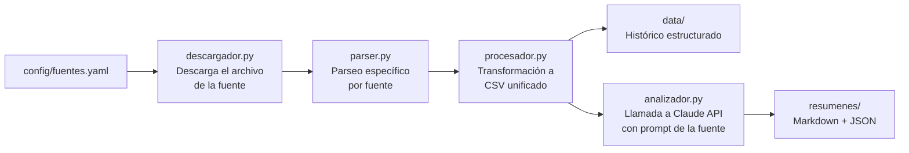

# mercados-diario

Sistema modular de monitorización diaria de mercados financieros con resúmenes generados por IA.

Descarga datos públicos de fuentes financieras cada día, los almacena como histórico estructurado, y genera un resumen ejecutivo con Claude API en el tono de una consultora de primer nivel (Goldman Sachs / Morgan Stanley).

---

## Arquitectura modular

El principio de diseño central es que **añadir una fuente nueva no requiere tocar la lógica del sistema**. Solo hay que crear una entrada en `config/fuentes.yaml` y, si el formato de datos es nuevo, un parser específico en `fuentes/<nombre>/parser.py`.

```
config/fuentes.yaml         ← Fuente nueva declarada aquí
fuentes/<nombre>/parser.py  ← Lógica de parseo específica (si hace falta)
fuentes/<nombre>/prompt.md  ← Prompt de IA adaptado a esa fuente
```

El núcleo (`core/`) no necesita modificarse.

---

## Cómo funciona



---

## Estructura de carpetas

```
mercados-diario/
├── config/
│   └── fuentes.yaml          ← Configuración declarativa de cada fuente
├── core/                     ← Lógica genérica reutilizable
│   ├── descargador.py        ← Descarga archivos por URL parametrizada
│   ├── procesador.py         ← Lee y transforma archivos a CSV unificado
│   ├── analizador.py         ← Llama a Claude API para generar resumen
│   └── utils.py              ← Helpers comunes (fechas, logging, etc.)
├── fuentes/                  ← Módulos específicos por fuente
│   └── meff/
│       ├── parser.py         ← Parseo específico del Excel del MEFF
│       └── prompt.md         ← Prompt de IA estilo Goldman Sachs para MEFF
├── data/                     ← Histórico de datos transformados (CSV)
├── resumenes/                ← Resúmenes generados (Markdown + JSON)
├── .github/workflows/
│   └── ejecucion_diaria.yml  ← GitHub Action programado (lun–vie, 21:00 UTC)
└── tests/
```

---

## Cómo añadir una fuente nueva

1. Abre `config/fuentes.yaml` y añade una nueva entrada con la misma estructura que `meff`:

```yaml
nueva_fuente:
  nombre: "Nombre Descriptivo"
  descripcion: "Qué datos proporciona esta fuente"
  url_plantilla: "https://ejemplo.com/datos/{fecha}.xlsx"
  formato: xlsx          # xlsx, csv, json...
  parser: nueva_fuente   # nombre de la carpeta en fuentes/
  prompt: nueva_fuente   # nombre del prompt en fuentes/<nombre>/prompt.md
```

2. Crea `fuentes/nueva_fuente/parser.py` con una función `parsear(ruta_archivo)` que devuelva un `pd.DataFrame` normalizado.

3. Crea `fuentes/nueva_fuente/prompt.md` con el prompt de IA adaptado a esa fuente.

4. Listo. El sistema lo recogerá automáticamente en la próxima ejecución.

---

## Configuración local

```bash
python -m venv .venv
.venv\Scripts\activate        # Windows
pip install -r requirements.txt

# Crea un archivo .env con tu clave de API:
# ANTHROPIC_API_KEY=sk-ant-...
```

---

## Fuentes activas

| Fuente | Descripción | Frecuencia |
|--------|-------------|------------|
| MEFF | Mercado Español de Futuros y Opciones — volumen y open interest de derivados | Diaria (L–V) |

---

## Uso

```bash
# Solo descarga (sin procesar ni analizar)
python -m fuentes.meff.parser 2026-06-04

# Descarga + parseo + histórico + anomalías
python -m fuentes.meff.parser 2026-06-04 --procesar

# Pipeline completo: procesa y genera resumen IA (requiere ANTHROPIC_API_KEY)
python -m fuentes.meff.parser 2026-06-04 --analizar

# Usar último día hábil automáticamente
python -m fuentes.meff.parser --analizar
```

Los resúmenes generados se guardan en `resumenes/meff/`:
- `YYYY-MM-DD.md` — texto Markdown listo para leer
- `YYYY-MM-DD.json` — metadatos (modelo, tokens, coste, texto)

---

## Variables de entorno

| Variable | Requerida | Descripción |
|----------|-----------|-------------|
| `ANTHROPIC_API_KEY` | Sí (para `--analizar`) | Clave de API de Anthropic. Obtener en [console.anthropic.com](https://console.anthropic.com). |

Crea un archivo `.env` en la raíz del proyecto (nunca lo subas al repositorio):

```
ANTHROPIC_API_KEY=sk-ant-...
```

En GitHub Actions, añade la variable como Secret en Settings → Secrets → Actions.

---

## Coste estimado

Cada resumen generado con `--analizar` consume aproximadamente:

| Componente | Tokens típicos | Coste (claude-sonnet-4-5) |
|------------|---------------|--------------------------|
| Prompt + contexto (entrada) | ~1.500–2.500 | ~$0,005–$0,008 |
| Resumen generado (salida) | ~400–700 | ~$0,006–$0,011 |
| **Total por ejecución** | | **~$0,01–$0,03** |

Precios de referencia: $3,00/MTok entrada · $15,00/MTok salida.
